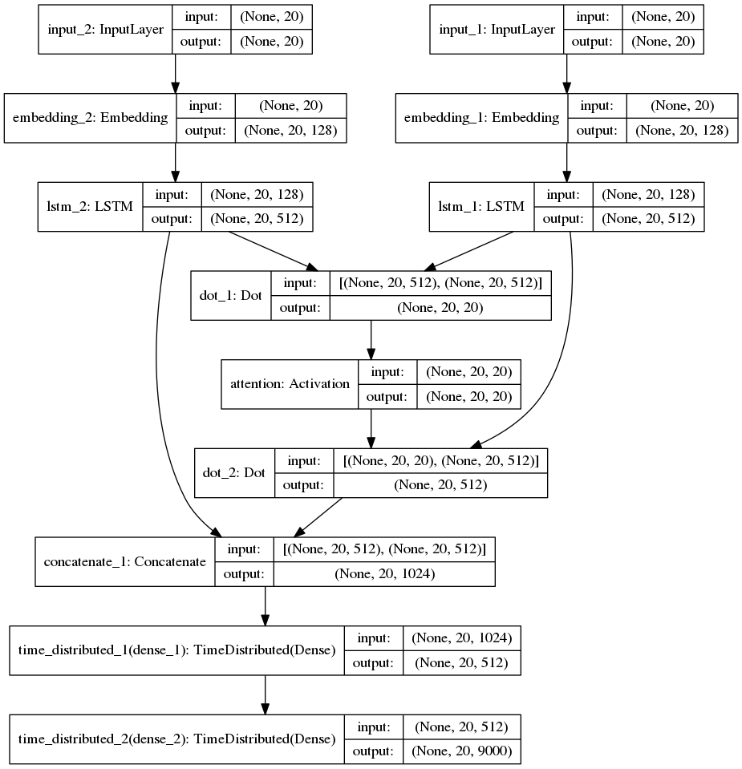
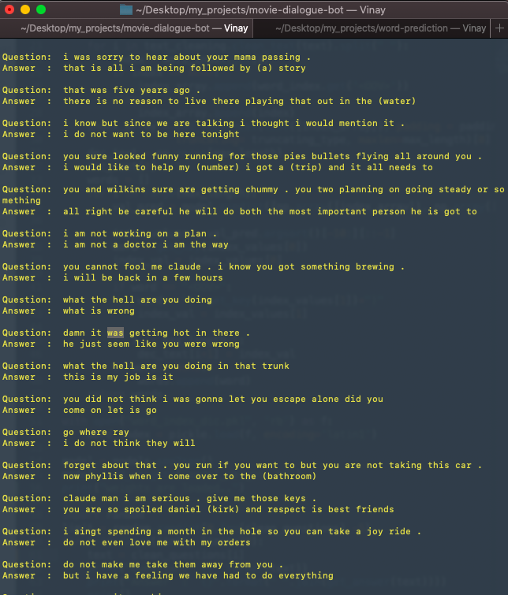

# Chatbot using Seq2seq model.


### Using Natural Language Processing with Deep Learning. Movie Dialogue dataset is used for training the Seq2seq model.

## Libraries

- [Keras](https://keras.io/)

- [Tensorflow](https://www.tensorflow.org/)

## Setup

- Install the requirements.

	```pip install -r requirements.txt```

- Prepare Dataset for training.

	```python prepare_data.py```

- Train the data.

	```python train.py```

or you could specify number of epoches to train

	```python train.py 30```

You could tune the Parameters by spectifying in settings.py file

## Google Colab

Enter and run the following snippet in the first cell to train in Google Colab environment. Don't forget to set hardware acceleration to GPU to speed up training!

```
!git init && git remote add origin https://github.com/VinayTurpati/movie-dialogue-chatbot.git
!pip install -r requirements.txt
```

After installing the requirements

```
python prepare_data.py
python train.py
```

## LSTM Model:



## After more than 30 epoches of training 


